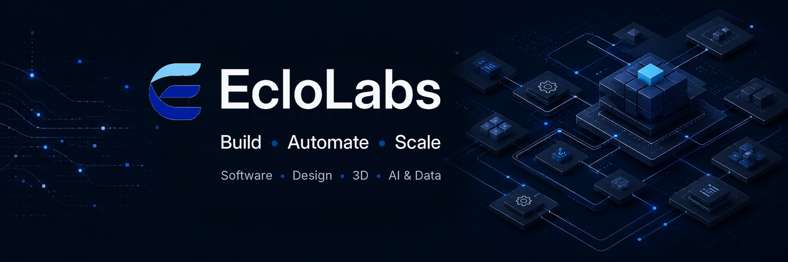

<!--
  EcloLabs — GitHub Organization Profile
  Version: 1.0
  Creative Technology Studio — Software • Design • 3D • AI & Data
  Build • Automate • Scale.
-->

  

<h1 align="center">EcloLabs</h1>

  <strong>Creative Technology Studio — Software • Design • 3D • AI & Data</strong>

  From idea to scalable digital product.

  <strong>Build • Automate • Scale.</strong>

---

## About EcloLabs

EcloLabs is a **Creative Technology Studio** helping startups, businesses and organizations turn ideas into useful, scalable digital products.

We work at the intersection of **Software, Design, 3D, AI & Data**, combining technology and creativity to solve real problems and build better digital experiences.

From strategy and product design to development, automation and deployment, we help transform ideas into **production-ready digital products**.

---

## What We Do

<table>
<tr>
<td width="50%" valign="top">

### 💻 Software Development

We design and build digital products and software solutions including:

- Web applications
- Mobile applications
- APIs
- Backend systems
- SaaS products
- Custom software
- System integrations

</td>
<td width="50%" valign="top">

### ✦ Product & UX/UI Design

We create clear, functional and scalable digital experiences through:

- Product design
- UX/UI design
- UX research
- User flows
- Prototyping
- Design systems
- Digital interfaces

</td>
</tr>
<tr>
<td width="50%" valign="top">

### ◈ 3D & Interactive Experiences

We create visual and interactive experiences through:

- 3D modeling
- 3D animation
- Motion design
- Visualization
- Interactive experiences
- Digital storytelling

</td>
<td width="50%" valign="top">

### ✧ AI, Data & Automation

We use intelligent systems and data to improve products and workflows through:

- AI integrations
- Applied machine learning
- Intelligent automation
- Data-driven solutions
- AI-powered workflows
- Process automation
- Data analysis

</td>
</tr>
</table>

---

## End-to-End Digital Product Development

Our four areas of expertise can work independently or together as one integrated product-development process.

**Idea → Strategy → Product & UX/UI Design → Software Development → AI, Data & Automation → Deployment → Iteration → Scale**

Whether a project starts as an early idea, an existing prototype or a product that needs to evolve, EcloLabs can contribute across the entire digital product lifecycle.

---

## Featured Projects

Our GitHub organization brings together selected **products, experiments, engineering projects and open-source initiatives** developed or supported by EcloLabs.

Projects are progressively published as they reach the appropriate level of maturity, documentation and readiness.

### 🇨🇲 Je Dénonce

**Je Dénonce** is an EcloLabs open-source civic-tech initiative currently being designed and reviewed for the Cameroonian context.

The project explores how technology can help structure civic issue reporting while addressing important questions around:

- Privacy
- Security
- Moderation
- Accessibility
- Low-connectivity environments
- French and English localization
- Responsible data handling
- Open-source governance
- Responsible civic technology

> **Current status:** Design and review stage.  
> No real-world reports are accepted at this stage.

The project is being developed progressively, beginning with documentation, research, risk analysis, product design and open-source governance before broader implementation.

<!--
When the public repository is ready, add a direct link here, for example:
[Explore Je Dénonce →](https://github.com/EcloLabs/je-denonce)
-->

### 💻 Software Projects

Our software work may include:

- Web platforms
- Mobile applications
- APIs
- Backend systems
- SaaS products
- Business applications
- Developer tools
- Custom digital products

### ✧ AI & Data Projects

Projects exploring:

- Artificial intelligence
- Machine learning
- Computer vision
- Natural language processing
- Recommendation systems
- Data analysis
- Intelligent automation
- AI-powered workflows

### ✦ Product & Design Systems

Projects involving:

- Product design
- UX/UI
- Design systems
- User flows
- Prototypes
- UX research
- Interface architecture
- Digital product experiences

### ◈ 3D & Interactive Projects

Projects involving:

- 3D modeling
- 3D animation
- Motion
- Visualization
- Interactive experiences
- Digital storytelling
- Creative technology experiments

> Explore our pinned repositories to discover selected EcloLabs projects and experiments.

---

## Open Source at EcloLabs

We believe open source can make technology more **transparent, collaborative, reusable and useful**.

EcloLabs uses open development where it makes sense to:

- Share knowledge and technical approaches
- Encourage collaboration
- Make important product and engineering decisions visible
- Enable community contributions
- Create reusable tools and foundations
- Improve projects through review and experimentation
- Document what we learn while building

Our goal is not simply to make source code public.

We aim to create projects that are understandable, documented, maintainable and, where appropriate, genuinely open to contribution.

---

## Open Source Principles

### Open by Design

Important decisions should be understandable and documented whenever possible.

### Responsible by Default

Openness should never come at the expense of privacy, security, safety or responsible engineering.

### Contribution Beyond Code

Open-source collaboration can involve much more than software development.

Depending on the project, contributors may participate through:

- Engineering
- Product design
- UX research
- Documentation
- Testing
- Accessibility
- Translation
- Data
- Research
- Security review
- Community feedback

### Build in Public When Appropriate

Sharing the process can sometimes be as valuable as sharing the final product.

We document lessons, trade-offs and important decisions whenever doing so does not create unnecessary security, privacy or operational risks.

---

## How We Work

### Clarity Over Complexity

Technology should solve problems, not create unnecessary complexity.

### Useful Innovation

We explore new technologies when they create meaningful value.

### Design + Engineering

Strong products require both thoughtful experiences and solid engineering.

### Show > Claim

We prefer working prototypes, real projects and demonstrable outcomes over unsupported claims.

### Responsible Technology

Security, privacy, accessibility and maintainability matter.

### Modular Thinking

We design systems that can evolve, adapt and scale over time.

### Continuous Learning

We experiment, document, test, improve and share what we learn.

---

## Technologies

Technology choices depend on the needs of each product.

Our work can span multiple areas of the digital product stack.

### Web

`React` • `JavaScript` • `TypeScript` • `HTML` • `CSS`

### Mobile

`Flutter` • `Dart`

### Backend & APIs

`Spring Boot` • `Laravel` • `REST APIs`

### Databases

`PostgreSQL` • `MySQL` • `MongoDB`

### AI & Machine Learning

`Python` • `Machine Learning` • `Computer Vision` • `NLP` • `Recommendation Systems`

### DevOps & Delivery

`Git` • `GitHub` • `GitHub Actions` • `CI/CD`

### 3D & Interactive

`Blender` • `3D Modeling` • `Animation` • `Visualization`

### Product & Design

`UX/UI` • `Product Design` • `Prototyping` • `Design Systems`

> Each repository documents the **actual technology stack, architecture and engineering decisions** used by that specific project.

We prefer showing technologies through real projects rather than maintaining an oversized list of tools.

---

## Featured Repositories

We use GitHub's native **Pinned repositories** section to showcase the most representative EcloLabs work.

Our long-term selection is organized around six types of proof:

### 01 — Flagship Product

A production-oriented digital product demonstrating EcloLabs' end-to-end capabilities.

### 02 — Open Source / Civic Tech

An open-source initiative such as **Je Dénonce**.

### 03 — AI & Data

A project demonstrating applied artificial intelligence, machine learning, data or automation.

### 04 — Product & UX/UI

A project documenting product design, UX/UI or a design system when GitHub is relevant to the work.

### 05 — 3D & Interactive

A project involving 3D, visualization, animation or an interactive experience.

### 06 — Developer Tool / Experiment

A reusable tool, technical experiment, library or open-source utility.

> **Quality over quantity.**  
> A project should be featured because it provides meaningful proof of work, not simply because a repository exists.

---

## Repository Standards

Important EcloLabs repositories should progressively include appropriate project documentation.

At minimum, an open-source repository may include:

- `README.md`
- `LICENSE`
- `CONTRIBUTING.md`
- `CODE_OF_CONDUCT.md`
- `SECURITY.md`

Depending on the project, the repository may also include:

- `.github/ISSUE_TEMPLATE/`
- `.github/PULL_REQUEST_TEMPLATE.md`
- `.github/CODEOWNERS`
- `.github/workflows/`

Larger initiatives may include:

- `GOVERNANCE.md`
- `ROADMAP.md`
- `SUPPORT.md`
- `CHANGELOG.md`
- `CITATION.cff`

Project-specific documentation can also be organized through:

- `docs/architecture/`
- `docs/product/`
- `docs/research/`
- `docs/decisions/`

Our goal is to publish projects that are:

- Understandable
- Reproducible where appropriate
- Maintainable
- Documented
- Secure
- Open to contribution when relevant

---

## Contributing

Some EcloLabs projects are open to external contributions.

Before contributing, check the repository for:

- `README.md`
- `CONTRIBUTING.md`
- `CODE_OF_CONDUCT.md`
- `SECURITY.md`
- Open issues
- Project-specific guidelines
- Roadmap
- Discussions

Contributions are not limited to code.

Depending on the project, you may be able to contribute through:

- Software engineering
- Product design
- UX research
- AI & Data
- 3D and visual work
- Documentation
- Testing
- Accessibility
- Translation
- Research
- Security
- Community feedback

Look for repository labels such as:

- `good first issue`
- `help wanted`
- `documentation`
- `design`
- `research`
- `accessibility`
- `translation`

Each project may define its own contribution process.

---

## Security

Security issues should **not** be reported through public GitHub issues when a repository provides a private vulnerability-reporting process.

Before reporting a vulnerability:

1. Read the repository's `SECURITY.md`
2. Follow the project's responsible disclosure instructions
3. Avoid publishing sensitive technical details publicly
4. Do not include real user data, credentials or secrets

Security procedures may differ depending on the nature of each project.

---

## Collaboration

EcloLabs works and collaborates with:

- Startups
- Businesses
- Organizations
- Founders
- Product teams
- Developers
- Designers
- Researchers
- Open-source contributors
- Technology communities
- Institutions

We are interested in collaborations involving:

**Software • Product & UX/UI • 3D • AI & Data • Automation • Open Source**

---

## Work With EcloLabs

Have an idea, product or collaboration in mind?

EcloLabs helps startups, businesses and organizations transform ideas into **scalable, production-ready digital products**.

We can contribute to a specific stage of a project or support the complete product journey.

**Strategy → Design → Development → Automation → Deployment → Scale**

### Project & Collaboration Inquiries

📩 **eclolabs@gmail.com**

---

## Connect With EcloLabs

Follow our work, projects, experiments and open-source initiatives across our official platforms.

<!--
Replace the plain platform names below with the official URLs once finalized.
Example:
- 💼 [LinkedIn](https://www.linkedin.com/company/...)
-->

- 🌐 **Website** — Coming soon
- 💼 **LinkedIn** — EcloLabs
- 🐙 **GitHub** — EcloLabs
- 🦊 **GitLab** — EcloLabs
- ▶️ **YouTube** — EcloLabs
- 📷 **Instagram** — EcloLabs
- 📘 **Facebook** — EcloLabs
- 🎵 **TikTok** — EcloLabs
- 🎨 **Behance** — EcloLabs
- 🖼️ **ArtStation** — EcloLabs
- 💬 **Discord** — EcloLabs
- 👽 **Reddit** — EcloLabs

> Official links will be added progressively as each platform is finalized.

---

## EcloLabs

  <strong>Creative Technology Studio — Software • Design • 3D • AI & Data</strong>

  From idea to scalable digital product.

  <strong>Build • Automate • Scale.</strong>

  © EcloLabs

